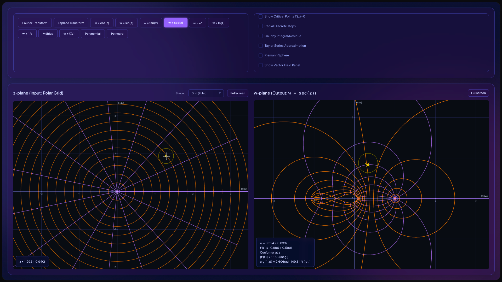
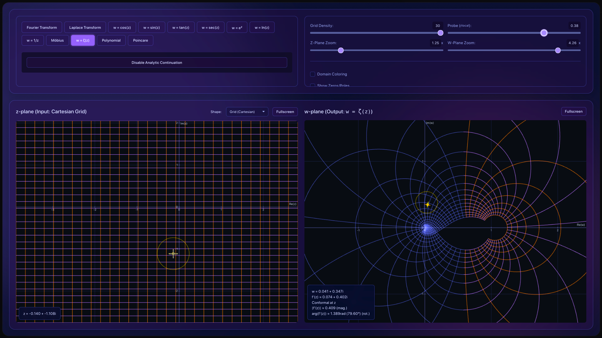

# Complex Function Analysis & Visualization

This repository contains a full-client-side web application for the interactive visualization of complex-valued functions, mappings, and related mathematical transformations. It aims to build an intuitive understanding of complex analysis through dynamic rendering.

## How it Works

The application architecture is split into math and analysis components that evaluate complex inputs, and a hybrid rendering system that draws the outputs. It tracks inputs (complex numbers) on a "z-plane" and displays corresponding mappings on an output "w-plane", alongside specialized sub-views for operations like Fourier and Laplace transforms.

For example, for the image mapping, the software looks at a pixel on the left side (the z-plane). It calculates the function for that point and moves the color of that pixel to the resulting coordinates on the right side (the w-plane). Because these functions are continuous, neighboring pixels stay near each other, but the space between them can be stretched, compressed, or rotated.

There is no build step or backend required. All calculations and rendering happen in the browser using vanilla JavaScript, WebGL, and HTML5 Canvas, supplemented by a few external libraries via CDN (`math.js`, `lodash`, and `plotly.js`).

## Calculation & Analysis

The core mathematical operations live in the `js/analysis/` and `js/math-utils.js` modules:

*   **Complex Arithmetic:** Powered by `math.js`, handling the evaluation of functions like $w = \cos(z)$, $w = e^z$, Möbius transformations, polynomials, and analytic continuations of the Riemann Zeta function.
*   **Feature Detection:** Algorithms in `feature-detection.js` and `root-finding.js` sample grids to approximate bounds and locate zeros (roots), poles (singularities), and critical points ($f'(z) = 0$).
*   **Transform Analysis:** Specific modules construct the matrices and summations required for continuous/discrete Fourier transforms (analyzing winding frequencies and center of mass) and Laplace transforms (s-plane pole/zero plotting and region of convergence).
*   **Calculus Operations:** Approximations of Taylor Series around custom origin points and computation of contour integrals (Cauchy's integral theorem and residues) evaluate continuously based on user-drawn paths or probe placements.
*   **Vector Mechanics:** `streamline.js` calculates vector fields and flow behaviors by interpreting complex derivatives and mapping them to directional velocity matrices.

## Rendering & Display

The rendering engine (`js/rendering/`) is highly modular, splitting responsibilities between 2D Canvas contexts, WebGL, and Plotly depending on the performance and topological requirements:

*   **HTML5 Canvas (2D):** Used for lightweight, interactive rendering. It parses UI inputs to draw Cartesian/polar grids, user-defined shapes (circles, lines, strips), contour endpoints, and hover-probe info overlays on both the z-plane and w-plane.
*   **WebGL:** Essential for continuous plane evaluations, particularly **Domain Coloring**. WebGL shaders map the argument (angle) of a complex number to a hue, and its magnitude to lightness/saturation. WebGL is also utilized for drawing densely transformed user-images mapping from the z-plane to the w-plane, ensuring 60fps performance during heavy pixel mathematical operations.
*   **Plotly (3D):** Integrated for three-dimensional topological concepts. This includes projecting the complex plane onto a 3D Riemann sphere viewing interface, and mapping the magnitude of the Laplace transform ($|F(s)|$) into a 3D surface plot.
*   **Animation System:** Handles time-domain progressions. Frame-requested loops drive particle flows through vector fields, simulate drawing out Taylor series approximations, and animate winding frequencies for integral transforms.
